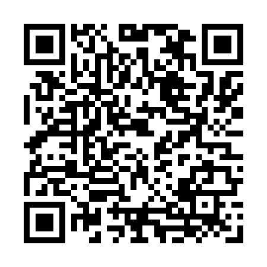

## Acesse os slides da aula de hoje {.center}

---

## Textos para debate {.center}

- **JENSEN, Helle Strandgaard.** *Digital Archival Literacy for (all) Historians*. Media History, v. 27, n. 2, p. 251–265, 2021.  
- **BRASIL, Eric; NASCIMENTO, Leonardo F.** *História digital: reflexões a partir da Hemeroteca Digital Brasileira e do uso de CAQDAS*. Estudos Históricos, v. 33, n. 69, p. 196–219, 2020.  

---

## Jensen (2020) – Digital Archival Literacy {.center}

- Propõe o conceito de **“alfabetização arquivística digital”**.  
- Arquivos digitais ≠ arquivos analógicos.  
- Nova lógica: produção, conteúdo, distribuição e uso.  
- Questão central: **como os sistemas moldam a pesquisa histórica?**  

---

## O arquivo como meio {.center}

- Inspirada nos **Estudos Culturais Britânicos**.  
- Arquivo digital = meio de comunicação.  
- Estruturado por:  
  - Financiamento  
  - Infraestrutura técnica  
  - Design de interface  
  - Métodos de distribuição  

---

## Popularização e viés {.center}

- Digitalização não é neutra.  
- Critério recorrente: disponibilizar o que já é **popular**.  
- Consequência: marginalização de temas menos rentáveis  
  - História da mídia  
  - Estudos de gênero  
  - Perspectivas decoloniais  

---

## O design importa {.center}

Três pontos de atenção no **design dos sistemas**:

1. **Categorias e tags** pré-definidas → codificam interpretações.  
2. **Algoritmos de busca** → pensados para o público geral, não para pesquisa especializada.  
3. **Metadados** → refletem escolhas de catalogação; influenciam diretamente a pesquisa.  

---

## Conclusões – Jensen {.center}

- Historiadores precisam se tornar **usuários ativos** dos arquivos digitais.  
- Problema da **“cultura de não citação”** → invisibiliza o uso de acervos digitais.  
- O futuro da pesquisa depende da compreensão e intervenção dos historiadores nos processos de:  
  - Produção  
  - Design  
  - Sustentabilidade dos arquivos digitais  

---

## Brasil & Nascimento (2020) {.center}

- **Questão central:** impacto das ferramentas digitais na pesquisa e na escrita da história.  
- Dois eixos principais:  
  1. **Fontes digitais** – caso da *Hemeroteca Digital Brasileira (HDB)*.  
  2. **CAQDAS** – softwares de análise qualitativa (ex.: *ATLAS.ti*).  

---

## Desnaturalizando o digital {.center}

- Muitos pesquisadores usam acervos digitais sem debate metodológico.  
- Perguntas que orientam o artigo:  
  - Há diferenças entre fontes digitais e tradicionais?  
  - As ferramentas digitais mudam a percepção e interpretação histórica?  

---

## Fontes digitais {.center}

- **Digitalização = rematerialização** (não simples “desmaterialização”).  
- A cópia digital:  
  - exige **cadeia de custódia** → autenticidade e integridade;  
  - perde propriedades do suporte físico;  
  - torna-se **reprodutível** e **dataficável**.  
- **Metadados** → dados sobre os dados, fundamentais para contextualizar e validar.  

---

## Estudo de caso: HDB {.center}

- **Potencialidades**:  
  - Acesso aberto a milhões de páginas.  
  - Busca textual → reconstrução de trajetórias (ex.: Moyses Zacharias da Silva).  
- **Limitações**:  
  - Dependência do OCR → erros e ausências.  
  - Risco de **fragmentação** → leitura só por palavras-chave, sem o todo.  

---

## CAQDAS e novos caminhos {.center}

- Softwares como **ATLAS.ti, NVivo, MAXQDA**.  
- Permitem:  
  - Codificação de trechos (*quotations*).  
  - Organização em redes e categorias analíticas.  
  - Relacionar textos, imagens, áudios e vídeos.  
- Vantagem: superar a fragmentação da busca nominal.  
- Ex.: **Flor do Abacate** → 1.272 ocorrências na HDB → só com CAQDAS é possível estruturar análise.  

---

## Conclusões - Brasil & Nascimento {.center}

- **Ferramentas não substituem o historiador** → rigor metodológico é responsabilidade do pesquisador.  
- Necessidade de **transparência metodológica**:  
  - Explicitar uso de HDB, CAQDAS, fluxos de trabalho.  
- A história digital exige um **“upgrade” teórico-metodológico**.  
- Desafio: não apenas usar, mas refletir criticamente sobre as ferramentas digitais.  

---

## Os artigos ainda tem sentido diante da virada com as IAs generativas? {.center}

- **Acesso e diálogo com arquivos:**  
  - Como os LLMs vão mediar nossa entrada nos acervos digitais?  
  - Haverá mais transparência ou novas “caixas-pretas”?  

---

## {.center}

- **CAQDAS e LLMs:**  
  - CAQDAS ainda tem sentido como ferramenta de organização e codificação?  
  - LLMs podem automatizar e expandir tarefas de análise qualitativa, mas quais os riscos?  

---

## {.center}

- **Atualidade dos debates:**  
  - As questões de Jensen (design, metadados, viés da popularidade) e de Brasil & Nascimento (rigor, rematerialização, fragmentação) continuam centrais.  
  - O desafio é aplicá-las criticamente às **novas tecnologias** de IA.  

---

